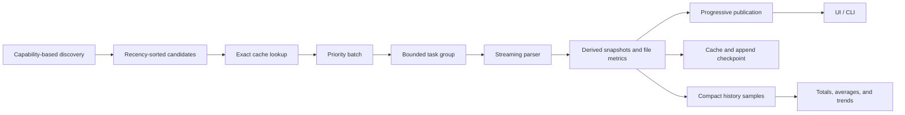

# Fast Concurrent Scanner Architecture

This document captures the reusable architecture behind Modex's local Codex
scanner. It is intended as a starting point for future macOS or Swift tools
that must scan many large, mostly append-only files with low latency, bounded
memory, and measurable resource use.

The design is not tied to Codex JSONL. The same pipeline applies to log
monitors, local indexers, importers, diagnostics tools, and other read-heavy
utilities.

## Goals And Invariants

A fast scanner should optimize the complete user experience, not only parser
throughput:

- Present useful cached or partial data immediately.
- Keep memory bounded as file count and file size grow.
- Bound concurrency instead of creating one task per file.
- Preserve deterministic result ordering even when work completes out of order.
- Reuse unchanged work and safely resume trusted append-only inputs.
- Keep discovery, scheduling, parsing, caching, aggregation, persistence, and
  presentation separate.
- Measure wall time, CPU work, memory, I/O, wakeups, and scheduler pressure.
- Treat source schemas and local filenames as capabilities, not stable APIs.
- Keep a complete synchronous or CLI path through the same core behavior.

The practical memory target is approximately:

```text
O(active concurrency * (chunk size + line cap + parser state) + derived cache)
```

Raw files, complete lines without a cap, and raw JSON records must not become
part of the retained cache.

## Pipeline



Each stage has an explicit contract. Discovery returns stable candidate
identity and recency metadata. Scheduling decides when work runs. Parsing
produces a derived snapshot plus factual metrics. Caching never decides UI
ordering. Presentation never performs file I/O.

## 1. Discover By Capability

Versioned filenames are weak contracts. A source may rename `state_5.sqlite`
to another version on a different machine while retaining the same useful
schema.

Prefer this sequence:

1. Enumerate plausible files by type in a deliberately bounded search area.
2. Open candidate databases read-only with a short busy timeout.
3. Inspect schema metadata such as `PRAGMA table_info`.
4. Require only the minimum identity columns.
5. Treat optional columns as nullable capabilities.
6. Select the best available recency field from known semantic alternatives.
7. Verify referenced source files still exist.
8. Fall back to filesystem discovery if no compatible index is found.

Modex requires only thread identity and rollout path. Titles, working
directories, model metadata, archive state, and recency fields are optional.
This keeps discovery working across installations and schema revisions.

Discovery should return candidates already ordered by the user's likely need,
usually most recently active first. Do not parse large content fields merely to
label or rank candidates when metadata can provide the answer.

## 2. Separate Fast First Paint From Complete Scanning

The scanner has two latency budgets:

- **First useful result:** enough data to populate the primary surface.
- **Complete result:** every eligible file for details, search, and aggregates.

Modex reserves the seven newest candidates as a priority batch. It parses that
batch with user-initiated priority and publishes every completed result. Only
after the priority batch completes does it scan the remainder at utility
priority.

For the remaining corpus, progress is coalesced. Publishing after every large
corpus result can cause more actor hops, sorting, aggregation, and SwiftUI work
than the parser itself. A useful starting stride is:

```text
max(8, configured concurrency * 4)
```

Always publish the final result, regardless of the stride.

Preserve candidate indices through the pipeline and sort by those indices when
constructing a snapshot. Completion order is nondeterministic; display and CLI
order should not be.

The UI must open from the last known snapshot. Opening a menu, window, or
popover must never await a fresh scan.

## 3. Bound Structured Concurrency

Do not enqueue one child task per file. A large corpus can otherwise create
avoidable task metadata, memory pressure, executor contention, and context
switches.

Use a refilling task group:

1. Add at most `N` child tasks.
2. Await one completion.
3. Consume or publish the result.
4. Add one replacement task.
5. Continue until no queued or active work remains.

`N` must be configurable and clamped to a reasonable machine-dependent range.
Report both configured and actually active concurrency. A configured value of
four does not mean four tasks were active when only one file required parsing.

Each child should check cancellation before opening a file. A malformed or
temporarily unavailable file should not abort the whole monitoring scan;
selected-versus-parsed counts and per-file diagnostics must make partial
failure visible.

More concurrency is not automatically better. File cache state, storage,
memory bandwidth, parser allocation, thermal state, and UI work all affect the
best value. Benchmark the whole pipeline at equal concurrency levels.

## 4. Stream Bytes With Explicit Memory Bounds

For line-delimited structured data:

- Read a configurable chunk from `FileHandle`.
- Search the bytes for line delimiters without decoding the complete chunk.
- Parse contiguous in-chunk lines as slices.
- Retain only the partial line that crosses a chunk boundary.
- Decode or unescape only fields the application needs.
- Treat absent, reordered, or unknown fields as valid input.

Modex uses a targeted byte scanner because it needs a small set of fields from
large JSONL logs. A general JSON parser remains the better choice when the
complete object graph or arbitrary nesting is required. The choice must be
made from representative benchmarks, not parser reputation.

### Oversized Records

A single pathological record must not defeat streaming memory bounds. Set a
maximum retained line size. When a line exceeds it:

1. Retain up to the cap.
2. Parse the retained prefix if the required fields are known to occur there.
3. Discard bytes until the next delimiter.
4. Count the oversized record in instrumentation.

This is source-specific. If required fields can occur after the cap, the safe
policy is to reject or spill the record instead of parsing a prefix.

### Autorelease Lifetime

Foundation file and data APIs can create autoreleased objects even in a pure
Swift loop. Wrap each chunk read and parse iteration in an `autoreleasepool` so
temporary objects are reclaimed per chunk rather than at the end of a huge
file. This reduced Modex's cold-scan footprint materially without changing the
parser algorithm.

Chunk size and line cap are independent controls:

- Larger chunks reduce read calls but raise temporary memory per active task.
- Larger line caps tolerate unusual records but raise worst-case retained
  memory per active task.

Expose both in expert settings and instrumentation. Do not tune them from
intuition alone.

## 5. Use Two Cache Paths

### Exact Reuse

Key exact results by stable file identity:

```text
standardized path + observed size + modification time
```

An exact hit returns the derived snapshot and parser checkpoint without opening
or reparsing the file. Count hits, misses, entries, and bytes avoided.

Keep this cache small and understandable. In Modex it is intentionally
in-memory, so restart behavior is obvious and stale on-disk cache migration is
not another failure mode.

### Verified Append Resume

Append-only logs commonly change on every refresh, so exact identity alone
still reparses their full history. Retain a bounded checkpoint containing:

- Derived snapshot and parser state.
- Partial-line state.
- Processed offset.
- A small fingerprint of bytes immediately before that offset.
- Existing oversized-line and buffer metrics.

When the same path grows:

1. Confirm the previous offset equals the previous observed file size.
2. Re-read the fingerprint window before the old offset.
3. Resume only when it matches.
4. Seek to the old offset and parse the appended bytes.
5. Otherwise perform a full parse.

This tail check is deliberately cheap. It protects against common truncation,
rotation, and rewrite cases, but it is not cryptographic proof that all earlier
bytes are unchanged. Use it only for trusted append-only sources. A hostile or
mutable source requires a stronger content identity.

Never keep raw chunks or complete input records in the cache. Replace an older
identity for a path when storing its new result.

## 6. Publish Derived Data, Not Parser Internals

The parser should return two products:

- A domain snapshot used by UI, CLI, and higher-level analysis.
- File metrics used by cache accounting and diagnostics.

File metrics should include bytes actually read, wall duration, buffer high
water mark, oversized records, cache status, append bytes avoided, and enough
identity to name a slow file meaningfully.

Aggregate those into one scan result. Cached files count as selected and
parsed, but their bytes should be reported as avoided rather than read. Keep
logical parser bytes separate from physical storage I/O.

## 7. Measure The Process Honestly

Take a native process sample immediately before discovery and another when a
result is published. On macOS, `proc_pid_rusage` and `getrusage` provide useful
dependency-free counters.

Report these semantics precisely:

- **Duration:** wall-clock time for the scan result.
- **Logical read:** bytes consumed by discovery and parsers.
- **Current memory:** process physical footprint at sample completion.
- **Lifetime peak:** maximum process physical footprint since launch, not a
  scan-local peak.
- **CPU time:** user plus system CPU consumed between samples.
- **Average CPU load:** CPU time divided by wall time. It can exceed 100% when
  work runs on multiple cores.
- **Physical I/O:** process storage bytes read and written. A warm filesystem
  cache can make physical reads zero while logical reads remain nonzero.
- **Wakeups:** idle and interrupt wakeups attributed to the process interval.
- **Context switches:** voluntary and involuntary scheduler switches attributed
  to the process interval.

These are process-wide deltas during the scan window, not perfect attribution
to one function. Concurrent UI or service work can contribute. They are still
valuable for regressions when the measurement conditions are consistent.

Do not derive watts or energy use from CPU time. Without a trustworthy public
power source, CPU time, physical I/O, wakeups, and context switches are honest
energy proxies, not energy measurements.

### Instrumentation Presentation Contract

Compact counters are only useful when their semantics remain accessible. Give
every metric a localized explanation close to its value. Paired values must
name their order, for example read / written bytes, idle / interrupt wakeups,
or voluntary / involuntary context switches.

Prefer a delayed hover that updates a fixed-height explanation area inside the
instrumentation surface. This avoids large callout balloons, content overlap,
and popover movement. The explanation must change with the aggregation mode:
latest-read CPU, one-hour total CPU, and average CPU per scan are different
measurements even when they occupy the same cell.

## 8. Persist Small Historical Samples

Persist one compact scan sample per completed refresh. Persist a thread sample
only when the underlying thread changed; writing identical thread snapshots on
every cache hit adds database and energy cost without information.

Useful historical views have different aggregation semantics:

- **Read:** values from the latest scan.
- **Window total:** sums of measured work in a fixed interval.
- **Per-scan average:** means over measured scans in the same interval.

For resource averages:

- Average memory is the mean completion footprint, not an average of lifetime
  peaks.
- Window-high memory is the maximum completion footprint in the interval.
- Average CPU time is total CPU time divided by scan count.
- Average CPU load should be weighted: total CPU time divided by total wall
  time, not the unweighted mean of percentages.
- Average I/O, wakeups, and context switches are per measured scan.

Exclude legacy rows that predate resource instrumentation. Always display the
sample count and interval so a value based on two scans is not mistaken for a
long-term baseline.

Keep enough raw samples to cover the promised window. If refresh frequency or
retention grows, aggregate older rows in SQLite rather than loading an
unbounded history into memory.

## 9. Benchmark Reproducibly

Debug builds materially distort Swift parser latency, allocations, and energy
proxies. Benchmark optimized release binaries.

A useful matrix holds these constant:

- Exact input corpus and total bytes.
- Warmup count and timed iteration count.
- Parser behavior and extracted fields.
- File concurrency.
- Archive inclusion and file ordering.
- Machine power and thermal conditions where practical.

Measure more than wall time:

- Timed scan duration.
- Maximum resident set size and peak physical footprint.
- CPU instructions and cycles.
- Voluntary and involuntary context switches.
- Logical and physical bytes where available.

On macOS, `/usr/bin/time -l` supplies native process counters without another
package. Clearly distinguish an internal timed iteration from counters that
cover process startup and warmup.

Benchmark cold full parsing, exact-cache refreshes, and append-resume refreshes
separately. A parser win that doubles RSS or scheduler churn may be a poor menu
bar-app tradeoff.

Keep experimental dependencies in a nested benchmark package. Modex's parser
comparison showed that adding SwiftNIO `ByteBuffer` alone did not improve this
file-scanning workload, and general JSON parsers carried different throughput,
memory, and context-switch tradeoffs. See
`Benchmarks/ParserComparison/README.md` for the reproducible matrix and current
machine-specific results.

## 10. Test The Contracts

At minimum, cover:

- Empty discovery and incompatible-schema fallback.
- Optional and renamed metadata columns.
- Active-only and archive-inclusive selection.
- Stable recency ordering under concurrent completion.
- Priority-batch publication before complete-corpus publication.
- Lines spanning chunks.
- Records larger than the line cap.
- Exact cache hits.
- Verified append resume.
- Growth, truncation, and rewrite fallback behavior.
- Configured versus active concurrency.
- Resource total and weighted-average arithmetic.
- CLI and app use of the same scanner result model.

Performance tests should use generated fixtures for correctness and a recorded
realistic corpus for throughput. Never encode one developer's absolute timing
as a unit-test threshold; use benchmark reports to compare variants.

## Modex Mapping

- `Sources/ModexCore/Services/CodexThreadIndex.swift`: schema-based read-only
  discovery.
- `Sources/ModexCore/Core/CodexSessionScanner.swift`: scheduling, streaming
  parser, exact cache, append checkpoint, and scan aggregation.
- `Sources/ModexCore/Services/ProcessResourceSampler.swift`: native macOS
  process counters.
- `Sources/ModexCore/Models/CodexSessionModels.swift`: scan and file metric
  contracts.
- `Sources/ModexCore/Models/ModexHistoryModels.swift`: historical totals and
  per-scan averages.
- `Sources/ModexCore/Services/ModexHistoryStore.swift`: compact SQLite history
  and retention.
- `Sources/modex/Services/ModexApplicationController.swift`: asynchronous
  publication, persistence, and UI-model updates.
- `Benchmarks/ParserComparison`: isolated release benchmark package and
  macOS-native measurement scripts.

## Reuse Checklist

Before shipping another concurrent scanner, confirm:

- [ ] Discovery is capability-based and has a safe fallback.
- [ ] Candidate identity, ordering, and scope are explicit.
- [ ] The first useful batch has its own latency budget.
- [ ] Active child tasks never exceed configured concurrency.
- [ ] Parser memory is bounded per active task.
- [ ] Temporary Foundation objects are drained per chunk.
- [ ] Oversized-record behavior is explicit and measured.
- [ ] Exact and append-resume cache paths are independently observable.
- [ ] Mutation invalidates append checkpoints safely enough for the source.
- [ ] Progressive updates are coalesced after the priority batch.
- [ ] Results remain deterministic despite out-of-order completion.
- [ ] Process metrics have precise, non-marketing semantics.
- [ ] Every compact metric and paired value has localized, mode-specific help.
- [ ] Historical totals and averages use measured samples and show sample count.
- [ ] Release benchmarks cover wall time, memory, CPU work, and scheduler cost.
- [ ] The CLI and UI share the scanner core.
